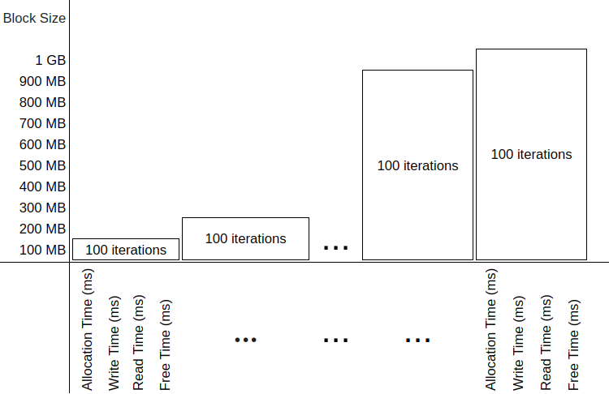
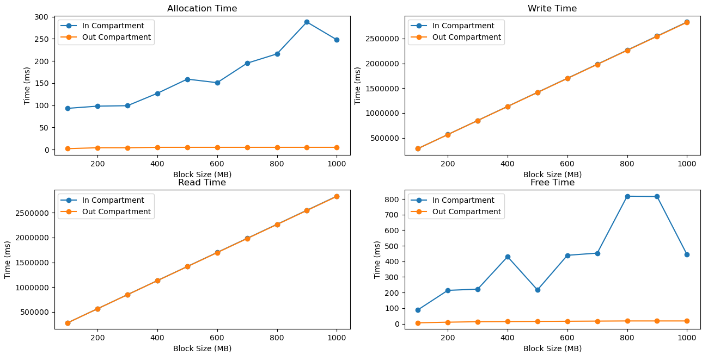
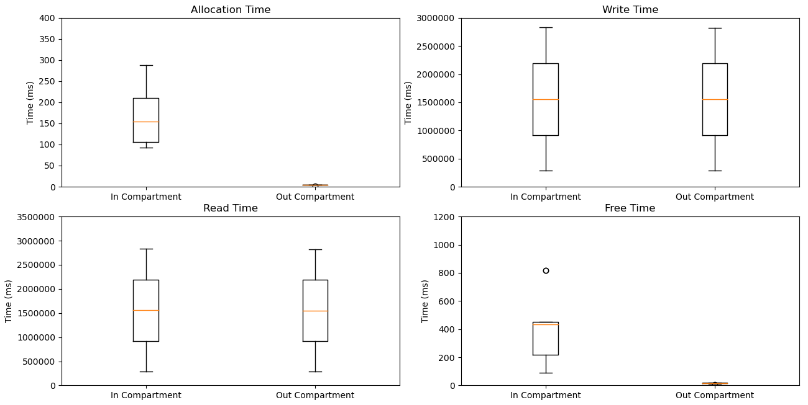

<h1 style="font-size: 2em;">Evaluation of performance of library-based compartments created on Morello Boards</h1>
<!-- Efficient Solution for Enterprise Application Integration Processes Deployed in Trusted Execution Environment -->

This repository evaluates compartments created using the library-based compartmentalisation tool available on Morello Boards running the cheriBSD 24.5 operating system. It  evaluates the performance costs incurred by the compartments and the strengths of the memory isolation that they provide. It provides links to the Git repositories that store the C codes used in the evaluation and the metrics collected in CSV files. It also includes the plots of the results, a discussion of our interpretation and detailed instructions to encourage practitioners to repeat our experiments and compare their results against ours. 

# 1. Experiments set up

We utilise a Morello Board, physically located in Toronto. A laptop connected to the network in Brazil is used to access the Morello Board via an SSH connection. Presented below is the primary configuration of the Morello Board, along with additional parameters, including the CheriBSD commands required to retrieve these configurations directly from the board. We specify the hardware and software configurations of the Morello Board used in the experiments in Table 1.

<!--<div align="center">
<p><em>Table 1. Morello board configuration parameters used in the experiments and the online cheriBSD commands to output them.</em></p>-->

*Table 1. Morello board configuration parameters used in the experiments and the online cheriBSD commands to output them.*

| **Component**       | **Specification**                                   | **Command**                                      |
|----------------------|-----------------------------------------------------|-------------------------------------------------|
| Operating System     | CheriBSD 24.5 (FreeBSD 15.0-CURRENT)                | `uname -a`                                      |
| Kernel Version       | FreeBSD 15.0-CURRENT, releng/24.05                  | `uname -v`                                      |
| Board                | Morello System Development Platform                 | `kenv \| grep smbios.system.product`             |
| RAM                  | 17 GB detected (16 GB DDR4, 2933 MT/s, ECC)         | `dmidecode --type memory`                       |
| Storage              | SSD                                                | `camcontrol identify ada0`                      |
| Architecture         | aarch64c (with CHERI support)                       | `sysctl hw.machine_arch`                        |
| Processor Model      | Research Morello SoC r0p0                           | `sysctl hw.model`                               |
| Number of CPUs       | 4                                                   | `sysctl hw.ncpu`                                |
| Compiler             | clang (with Morello support)                        | `clang-morello --version`                       |
| Tool                 | proccontrol (for CHERI compartments)                | `proccontrol -m cheric18n -s enable ./binary`   |
| Access               | Remote via SSH                                      | `ssh -i private_key user@server`               |


It is worth explaining that, as shown in the CSV files available in this repository, we repeated the execution of each operation 100 times during our experiments, collected the measurements, and averaged the results. The choice of 100 repetitions was based on the Central Limit Theorem, which suggests that a sample size of 100 is often adequate to yield a statistically meaningful average [Dudley 2014](https://doi.org/10.1017/CBO9781139014830).


## 1.1. Compilation and Execution

The inclusion or exclusion of library-based compartments is determined at compilation and execution time, as documented in the manuals:
- [Gao, 2024](https://man.cheribsd.org/cgi-bin/man.cgi/c18n)
- [Cheri Team, 2022](https://github.com/CTSRD-CHERI/cheripedia/wiki/Library-based-%20Compartmentalisation)
- [Watson, 2019](https://www.cl.cam.ac.uk/research/security/ctsrd/cheri/cheri-compartmentalization.html)


### 1.1.1. Compilation and Execution Without Library-Based Compartments

The normal compilation (without the inclusion of library-based compartments) is demonstrated in the following example for a `helloworld.c` program:

```bash
$ clang-morello -o hello hello.c
```

To execute `helloworld`, the programmer can type:

```bash
$ ./helloworld
```

### 1.1.2. Compilation and Execution With Library-Based Compartments

The following command demonstrates the compilation flags required to enable library-based compartments:

```bash
$ clang-morello -march=morello+c64 -mabi=purecap -o helloworld helloworld.c
```

- The `-march=morello+c64` parameter defines the 64-bit Morello architecture.
- The `-mabi=purecap` flag sets the Application Binary Interface (ABI) for the secure environment, representing all memory references and pointers as capabilities.

To execute the `helloworld` program in a library-based compartment, the programmer can type:

```bash
$ proccontrol -m cheric18n -s enable helloworld
```

The binary is executed with library compartmentalisation enabled using `proccontrol`.

We use the example shown above in subsequent sections to compile and execute the programs used in the evaluation.


# 3. Memory performance in the execution of allocate, release, read and write operations

To collect metrics we execute a C program compiled and executed without compartments and with compartments:

- **Compilation and execution without compartments:**  
  [memory-out-experiment.c](https://github.com/gca-research-group/tee-morello-performance-experiments/blob/main/memory-performance/outside-tee-exection/memory-out-experiment.c).

  ```bash
  $ clang-morello -o memory-in-experiment memory-in-experiment.c -lm
  
  $ ./memory-in-experiment
  ```

- **Compilation and execution with compartments:**  
  [memory-in-experiment.c](https://github.com/gca-research-group/in-out-tee-integration-case-study/blob/main/outside-tee-exection/memory-out-experiment.c).

  ```bash
  $ clang-morello -march=morello+c64 -mabi=purecap -o memory-in-experiment memory-in-experiment.c -lm
  
  $ proccontrol -m cheric18n -s enable memory-in-experiment
  ```

In this experiment, we use the code shown in Algorithm 1. It executes the following operations on large blocks of memory:

a) **allocation:** time required to allocate a block of memory.  
b) **write:** time required to write data to fill the entire memory block.  
c) **read:** time taken to read the data from the entire memory block.  
d) **free:** time taken to release the memory block back into the main memory.

As shown in Figure 1, we use blocks of `100, 200, 300,...,100 000 MB` as large blocks of memory. Blocks of these sizes are typical of applications that process images and access databases.




*Figure 1: Performance of memory operations on memory blocks of different sizes.*

<pre style="border: 1px solid #ddd; padding: 10px; background-color: #f9f9f9; font-family: monospace;">
Algorithm 1: Execution of memory operations and metric collections of their executions

1. perform_trials(results_file, total_execution_time)
2. begin
3.     foreach current_block_size in MIN_BLOCK_SIZE to MAX_BLOCK_SIZE step BLOCK_STEP do
4.         foreach trial_number from 1 to NUM_TRIALS do
5.             allocation_duration = time(allocate_memory(current_block_size))
6.             write_duration = time(write_to_memory(memory_block, current_block_size))
7.             read_duration = time(read_from_memory(memory_block, current_block_size))
8.             free_duration = time(deallocate_memory(memory_block))
9.             log(results_file, current_block_size, trial_number, allocation_duration, write_duration, read_duration, free_duration)
10.        endfor
11.    endfor
12. end
</pre>

Execution begins with the `perform_trials` function (line 1), which receives a log file as an input parameter to store performance metrics, including the total time taken to run the trials. The for-loop (line 3) iterates over memory blocks of different sizes ranging from `MIN_BLOCK_SIZE` to `MAX_BLOCK_SIZE` with increments specified by `BLOCK_STEP`. The inner for-loop (line 4) repeats the trial `NUM_TRIALS` times for each block size. `NUM_TRIALS` is defined by the programmer as a constant.

At each iteration, the memory allocation time is measured with the time function (line 5); the time to write to the block is measured in line 6, the time to read the block is measured in line 7 and, finally, the time to free the memory is measured in line 8. The metrics collected are recorded in the log file along with the trial number (line 9).


## 3.1. Results 

The metrics collected are stored in two separate CSV files: [memory-in-experiment-results.csv]([https://github.com/gca-research-group/tee-morello-performance-experiments/blob/main/cpu-performance/inside-tee-execution/cpu_in-experiment-result.csv](https://github.com/gca-research-group/in-out-tee-integration-case-study/blob/main/inside-tee-execution/memory-in-experiment-results.csv)) for the run inside a compartment. The file [memory-out-experiment-results.csv](https://github.com/gca-research-group/in-out-tee-integration-case-study/blob/main/outside-tee-exection/memory-out-experiment-results.csv) collects metrics of the run without compartments. We calculate the average time that it takes to allocate, write, read and free for  each block size of 100 MB, 200 MB, 300 MB, etc.).The results are summarised in Tables 2 and 3.


<!--<div align="center">
<p><em>Table 2: Performance of memory operations executed inside a compartment, including mean and standard deviation.</em></p>-->

*Table 2: Performance of memory operations executed inside a compartment, including mean and standard deviation.*

| **Block Size (MB)** | **Allocation Time (ms)** | **Write Time (ms)** | **Read Time (ms)** | **Free Time (ms)** |
|---------------------|--------------------------|---------------------|--------------------|--------------------|
| 100                 | 93 ± 171.27             | 283,239 ± 58.31     | 283,133 ± 28.83    | 89 ± 180.05        |
| 200                 | 98 ± 221.17             | 566,458 ± 82.10     | 566,269 ± 65.02    | 214 ± 397.35       |
| 300                 | 99 ± 295.44             | 849,705 ± 131.43    | 849,396 ± 87.16    | 222 ± 452.92       |
| 400                 | 127 ± 430.92            | 1,132,983 ± 189.58  | 1,132,550 ± 106.44 | 430 ± 788.02       |
| 500                 | 159 ± 599.09            | 1,416,190 ± 189.97  | 1,415,698 ± 123.68 | 217 ± 420.54       |
| 600                 | 151 ± 648.00            | 1,699,454 ± 255.41  | 1,698,795 ± 174.82 | 439 ± 921.59       |
| 700                 | 195 ± 880.05            | 1,982,654 ± 245.07  | 1,981,909 ± 122.70 | 453 ± 979.92       |
| 800                 | 216 ± 1,084.49          | 2,265,901 ± 235.38  | 2,265,075 ± 139.94 | 818 ± 1,513.98     |
| 900                 | 288 ± 1,536.92          | 2,549,115 ± 258.37  | 2,548,205 ± 196.83 | 816 ± 1,579.74     |
| 1000                | 248 ± 1,543.50          | 2,832,372 ± 337.74  | 2,831,332 ± 167.56 | 444 ± 1,003.29     |


<!--<div align="center">
<p><em>Table 3: Performance of memory operations executed outside a compartment, including mean and standard deviation.</em></p>-->

*Table 3: Performance of memory operations executed outside a compartment, including mean and standard deviation.*

| **Block Size (MB)** | **Allocation Time (ms)** | **Write Time (ms)** | **Read Time (ms)** | **Free Time (ms)** |
|---------------------|--------------------------|---------------------|--------------------|--------------------|
| 100                 | 2 ± 4.77                | 282,584 ± 13.86     | 282,581 ± 12.79    | 6 ± 4.52           |
| 200                 | 4 ± 4.19                | 565,164 ± 17.12     | 565,163 ± 18.85    | 10 ± 4.03          |
| 300                 | 4 ± 1.77                | 847,755 ± 21.18     | 847,752 ± 64.89    | 13 ± 3.66          |
| 400                 | 5 ± 3.09                | 1,130,330 ± 21.00   | 1,130,328 ± 28.20  | 14 ± 2.27          |
| 500                 | 5 ± 3.07                | 1,412,907 ± 31.49   | 1,412,903 ± 28.92  | 15 ± 2.37          |
| 600                 | 5 ± 1.56                | 1,695,493 ± 32.97   | 1,695,493 ± 30.19  | 16 ± 1.28          |
| 700                 | 5 ± 1.52                | 1,978,083 ± 52.24   | 1,978,098 ± 79.47  | 17 ± 0.86          |
| 800                 | 5 ± 1.73                | 2,260,662 ± 41.09   | 2,260,660 ± 53.11  | 18 ± 0.62          |
| 900                 | 5 ± 0.54                | 2,543,249 ± 47.19   | 2,543,234 ± 42.16  | 18 ± 0.97          |
| 1000                | 5 ± 0.50                | 2,825,823 ± 47.72   | 2,825,818 ± 41.68  | 18 ± 0.64          |



*Figure 2: Time to execute allocate, write, read and release memory operations.*


- **Allocation time:** A comparison of Table 3 with Table 2 reveals that allocating memory blocks inside compartments takes significantly longer. For example, the allocation of a 100 MB block takes 2 ms outside a compartment, while it takes 93 ms inside a compartment. Allocation times outside compartments remain stable, ranging from 2 to 5 ms across all block sizes. In contrast, allocation times inside compartments exhibit considerable variability, ranging from 93 ms for 100 MB blocks to 288 ms for 900 MB blocks, with fluctuations influenced by block size. This variability highlights the overhead introduced by compartmentalisation mechanisms.

- **Write time:** Both tables demonstrate a linear increase in write time as the block size grows. However, execution inside a compartment consistently takes longer. For instance, writing to a 100 MB block outside a compartment takes 282,584 ms, while the same operation inside a compartment takes 283,239 ms. The difference becomes more pronounced as block sizes increase, reflecting the cumulative overhead introduced by secure memory operations within the compartment.

- **Read time:** The time required for read operations also increases linearly with block size in both configurations. However, execution within a compartment consistently results in higher read times. For example, reading a 100 MB block takes 282,581 ms outside a compartment and 283,133 ms inside. As the block size increases to 1 GB, read times reach 2,825,818 ms outside and 2,831,332 ms inside the compartment, demonstrating a consistent overhead.

- **Free time:** The metrics indicate a stark contrast in memory release times between the two configurations. Table 3 shows that freeing memory outside a compartment is highly efficient, with times ranging from 6 to 18 ms across block sizes. In contrast, Table 2 highlights the significant overhead when freeing memory inside a compartment, with times ranging from 89 ms for 100 MB blocks to 818 ms for 800 MB blocks. The high variability, as reflected by large standard deviations, is attributed to the additional security and management overhead inherent in compartmentalised environments.

Plots of the results from Tables 2 and 3 shown in Figures 2 and 3. Full records are available from [memory-in-experiment-result.csv](https://github.com/gca-research-group/tee-morello-performance-experiments/blob/main/memory-performance/inside-tee-execution/memory-in-experiment-resuls.csv) and [memory-out-experiment-result.csv](https://github.com/gca-research-group/tee-morello-performance-experiments/blob/main/memory-performance/outside-tee-exection/memory-out-experiment-resuls.csv).




*Figure 3: Dispersion of the time to execute allocate, write, read, and free operations.*


# 4. Python scripts that can help to summarise and visualise results

If needed, these Python scripts can be used to summarise the raw collected metrics and present results graphically. They produce aggregated CSV files and comparative plots.


## 4.1. Python scripst for summary views

- [inside-tee-execution](https://github.com/gca-research-group/in-out-tee-integration-case-study/tree/main/inside-tee-execution/summarise-results)
- [outside-tee-execution](https://github.com/gca-research-group/in-out-tee-integration-case-study/tree/main/outside-tee-exection/summarise-results)


## 4.2. Python script for plotting

- [plot-graph](https://github.com/gca-research-group/in-out-tee-integration-case-study/tree/main/plot-graph)

